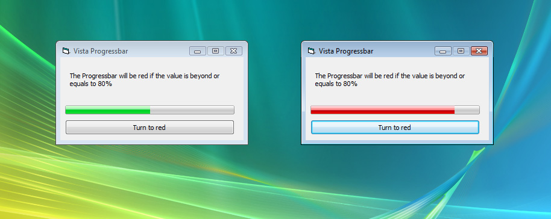



## Animated progress bar with green &amp; red color

### Description

This progress bar has the vista style. Works fine coz I used it to one of my projects

Features:

* Moves with animaton

* Vista style

* Both Green &amp; Red colors supported

My special thanks goes to people who build the stuff earlier

Keywords: vista progressbar aero crystal controls keith wickramasekara style Prog animate progress
 
### More Info
 
This progress bar has the vista style. Works fine coz I used it to one of my projects

Features:

* Moves with animaton

* Vista style

* Both Green &amp; Red colors supported

My special thanks goes to people who build the stuff earlier

Keywords: vista progressbar aero crystal controls style Prog animate progress

             |
---                |---
**Submitted On**   |2007-10-18 00:25:16
**By**             |[Keith Wickramasekara](https://github.com/Planet-Source-Code/PSCIndex/blob/master/ByAuthor/keith-wickramasekara.md)
**Level**          |Intermediate
**User Rating**    |5.0 (30 globes from 6 users)
**Compatibility**  |VB 3\.0, VB 4\.0 \(16\-bit\), VB 4\.0 \(32\-bit\), VB 5\.0, VB 6\.0
**Category**       |[Custom Controls/ Forms/  Menus](https://github.com/Planet-Source-Code/PSCIndex/blob/master/ByCategory/custom-controls-forms-menus__1-4.md)
**World**          |[Visual Basic](https://github.com/Planet-Source-Code/PSCIndex/blob/master/ByWorld/visual-basic.md)
**Archive File**   |[Animated\_p20873510162007\.zip](https://github.com/Planet-Source-Code/keith-wickramasekara-animated-progress-bar-with-green-amp-red-color__1-69506/archive/master.zip)

